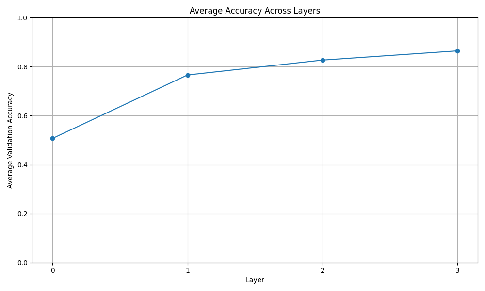

# Platonic Representation

[](https://colab.research.google.com/drive/1lIp2npuGWM4JiuvWlCtbm6ENpf22WAbH?usp=sharing)



## Introduction

This project draws inspiration from the June 2024 article by Philip Isola and his students: [Platonic Representation Hypothesis](https://phillipi.github.io/prh/). The central idea is that models trained on different data types (image, audio, text) converge towards the same representation in latent space.

The code for training the transformers is based on the work of Andrej Karpathy (nanoGPT): [GitHub nanoGPT](https://github.com/karpathy).

In this project, we test this hypothesis on a very simple world: Tic-tac-toe. We train two transformers with the same architecture and number of parameters on:
1. PNG images of games
2. Games in standard textual notation (see [Wikipedia: Tic-tac-toe](https://en.wikipedia.org/wiki/Tic-tac-toe))

## Quick Start

### Installing Dependencies

```bash
pip install torch numpy transformers datasets tiktoken wandb tqdm
```

### Training the Text-Based Transformer

```bash
cd platonic_representation
python data/txt/prepare_txt.py
python train.py config/train_txt.py
```

### Sampling for the Text Model

```bash
python sample.py --out_dir=out-shakespeare-char
```

### Training the Image-Based Transformer

```bash
cd platonic_representation
python img_game_generator.py
python data/img/prepare_img.py
python train.py config/train_img.py
```

### Sampling for the Image Model

```bash
python sample.py --out_dir=out-shakespeare-char
```

### Probing layer by layer for txt

To run the linear probes layer by layer (see graphs in /assets), you can run:

```bash
python probing_txt.py
```

This project is currently under development. Should you have any questions, please don't hesitate to contact me!